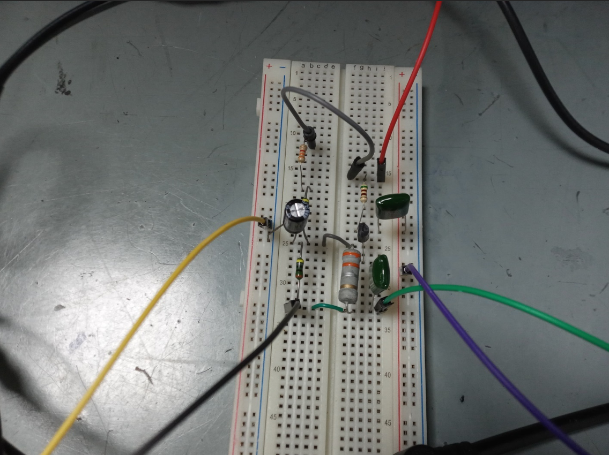
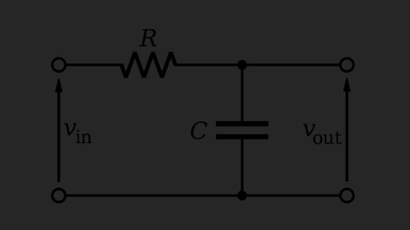

# 🎓 IE2030 Analog Electronics – AM Radio Amplifier Project

🚀 **Project Title:** Multi-Stage Amplifier and Filtering Circuit  
📍 **Module:** IE2030 – Analog Electronics  
🏫 **Institute:** SLIIT | BSc (Hons) in IT – CSNE Specialization  
👨‍🔧 **Student:** Gamaethige Thisara Sandeepa

---

## 🔧 Project Overview

This project simulates the **audio output section of an AM radio**, integrating:

- 🎚️ **High-Pass Filter** – Cuts off low-frequency noise (1 kHz cutoff)
- 📢 **Common-Emitter BJT Amplifier** – Amplifies weak signals (Gain ≈ 50)
- 🎚️ **Low-Pass Filter** – Filters high-frequency noise (15 kHz cutoff)
- 🔌 **Dot Board Implementation** – Fully soldered analog circuit

---

## 📷 Preview

| Stage | Description        | Oscilloscope Output                    |
|-------|--------------------|----------------------------------------|
| 1️⃣   | High-Pass Filter    |      |
| 2️⃣   | BJT Amplifier       |    |
| 3️⃣   | Low-Pass Filter     |        |

*(Replace with actual images if available)*

---

## 📄 Full Report

🔗 [Click here to view the full assignment PDF](./IE2030-Analog%20Electronic%20Assignment(IT23584990).pdf)

---

## 🛠️ Technologies & Components

- BC547 NPN Transistor  
- Mylar Capacitors (10nF, 100nF)  
- Resistors (16kΩ, 100Ω, etc.)  
- 9V DC Power  
- Oscilloscope & Function Generator

---

## 🗣️ Reflection

> This project strengthened my understanding of signal filtering, transistor biasing, and hands-on circuit building. It challenged me to combine theoretical knowledge with practical debugging to produce a clean audio signal.

---

## 📬 Contact

📧 gamaethigethisara@gmail.com  
🔗 [LinkedIn – Gamaethige Thisara](https://www.linkedin.com/in/gamaethigethisara/)
